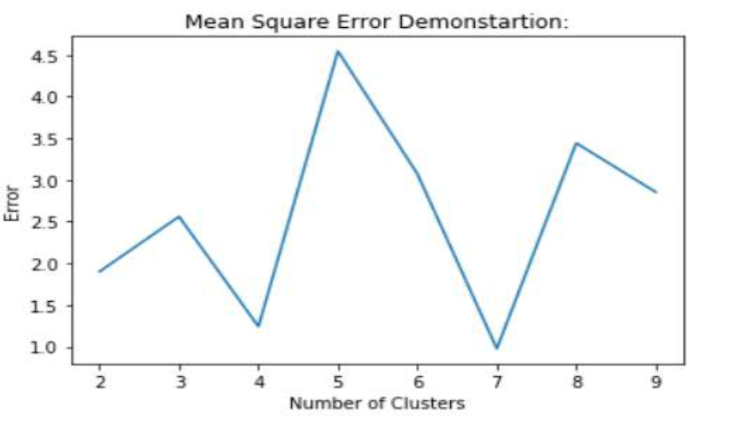
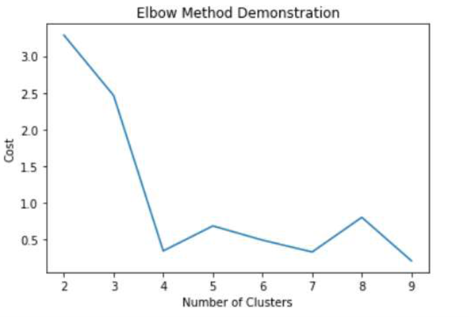
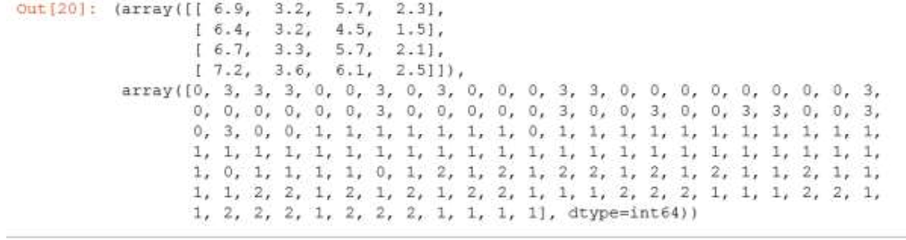

# Kmeans Clustering
The objective of this project is to use k-mean clustering algorithm to cluster iris data set
into different clusters.

The whole problem is handled using the following 8 steps.

#### Step 1: Load the data and convert into data matrix

#### Step 2: Calculate the Euclidean distance between two data points
#### Step 3: Assign labels to the data points
#### Step 4: Calculating the new centroids after data points are labelled
#### Step 5: Test the algorithm Convergence
#### Step 6: Evaluate Performance of each cluster
#### Step 7:Calculate Means Square Error for the all clusters
The following plot demonstrates the mean square error vs number of clusters  

  Figure 1: Mean Square Error
  

   
#### Step 8: Elbow Method Calculation
The elbow method calculates the required number of clusters used to classify the iris
data set into different clusters.

  Figure : Elbow Method
  

   
 
  
As we can see from the plot, we can classify the Iris data set using 4 clusters. We can use more clusters
but 4 clusters are enough for this data set.

#### Step 9: Testing the overall work using the k-means(x, cluster) function.

Testing the k_means using four clusters results the following results

  Figure: Kmeans Classification
  

   

As we can see from the classification output, the function returns list of centroids and labels for each data
points in four different clusters.

